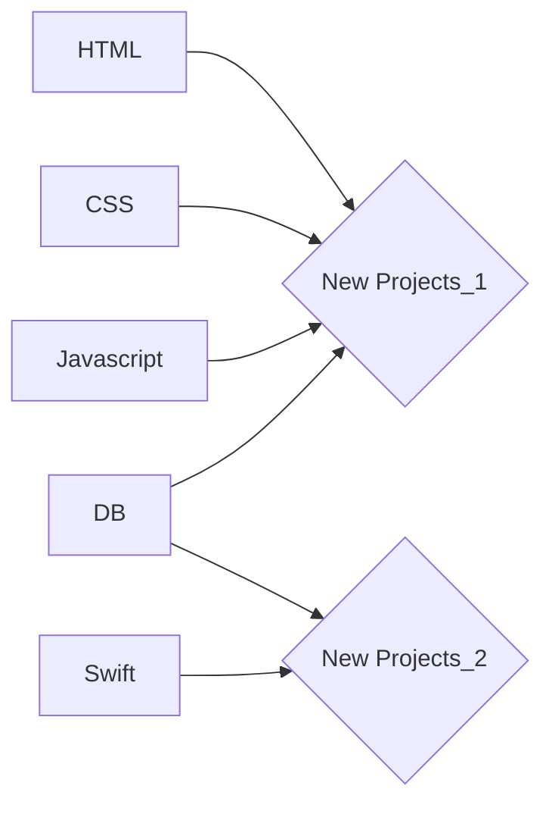

# My Study note

:kr: 공부한 기록
:us: record of what I have studied
:jp: 勉強した記録

---
# Road map

```mermaid
graph LR
A[HTML]
B[CSS]
C[Javascript]
D{New Projects_1}
A --> D
B --> D
C --> D
E --> D
E[DB]
F[Swift]
G{New Projects_2}
E --> G
F --> G

```
